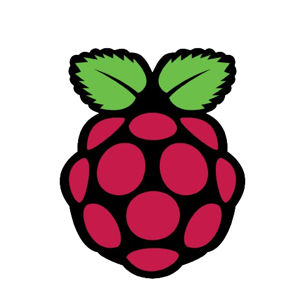

<!-- Improved compatibility of back to top link: See: https://github.com/othneildrew/Best-README-Template/pull/73 -->
<a name="readme-top"></a>
<!--
*** Thanks for checking out the Best-README-Template. If you have a suggestion
*** that would make this better, please fork the repo and create a pull request
*** or simply open an issue with the tag "enhancement".
*** Don't forget to give the project a star!
*** Thanks again! Now go create something AMAZING! :D
-->


<!-- PROJECT SHIELDS -->
<!--
*** I'm using markdown "reference style" links for readability.
*** Reference links are enclosed in brackets [ ] instead of parentheses ( ).
*** See the bottom of this document for the declaration of the reference variables
*** for contributors-url, forks-url, etc. This is an optional, concise syntax you may use.
*** https://www.markdownguide.org/basic-syntax/#reference-style-links
-->
  ![MIT License][license-shield]
  [![LinkedIn][linkedin-shield]][linkedin-url]


<!-- PROJECT LOGO -->
<br />
<div align="center">
    

  <h3 align="center">The Pi-Ponics Project</h3>

  <p align="center">
    A self-sustaining plant growing system controlled by a Raspberry Pi!
    <br />
    <br />
    <br />
    <a href="https://www.youtube.com/shorts/MetlIHa8CLs">View Demo</a>
    ·
    <a href="https://github.com/Tybenson0/Pi-Ponics/issues">Report Bug</a>
    ·
    <a href="https://github.com/Tybenson0/Pi-Ponics/pulls">Request Feature</a>
  </p>
</div>


<!-- TABLE OF CONTENTS -->
<details>
  <summary>Table of Contents</summary>
  <ol>
    <li>
      <a href="#about-the-project">About The Pi-Ponics</a>
      <ul>
        <li><a href="#built-with">Built With</a></li>
      </ul>
    </li>
    <li>
      <a href="#getting-started">Getting Started</a>
      <ul>
        <li><a href="#prerequisites">Prerequisites</a></li>
      </ul>
    </li>
    <li><a href="#usage">Usage</a></li>
    <li><a href="#license">License</a></li>
    <li><a href="#contact">Contact</a></li>
  </ol>
</details>

<br />
<br />


<!-- ABOUT THE PROJECT -->
## About Pi-Ponics
<div align="center">

</div>
<p align="center"> Pi-Ponics is an innovative hydroponics system seamlessly integrated with the power of Raspberry Pi Pico. 
   <br />
     <br />
  Empowering enthusiasts and growers, Pi-Ponics offers a cutting-edge solution for cultivating plants through precise control and automation. 
   <br />
   <br />
  Leverage the capabilities of Raspberry Pi Pico to manage essential parameters like nutrient delivery, lighting, and environmental conditions, ensuring optimal growth for your plants. 
   <br />
   <br />
  Explore the future of hydroponics with Pi-Ponics – where technology and agriculture converge for a smarter, more efficient cultivation experience.</p>
   <br />
    <br />

<p align="right">(<a href="#readme-top">back to top</a>)</p>
<br />
<br />


### Built With
<br />

Pi-Ponics is made with a Raspberry Pi Pico microcontroller and peripherals, the thonny IDE, and Micropython. Along with pvc pipe, hoses, and fittings.
<br />
<br />

<div align="center">
   
  &nbsp;&nbsp;&nbsp;
  
  &nbsp;&nbsp;&nbsp;
  
</div>
<br />
<br />
<br />
<br />


<p align="right">(<a href="#readme-top">back to top</a>)</p>


<!-- GETTING STARTED -->
## Getting Started

How to get started with your own Pi-Ponics system!

<br />

### Prerequisites

This is an example of how to list things you need to use the software and how to install them.
* Clone Repository
  ```sh
  git clone https://github.com/Tybenson0/Pi-Ponics.git
  ```


<!-- USAGE EXAMPLES -->
## Usage

Open and follow instruction set included in the repository

<div align="center">

    </a>
</div>
<br />
<br />

Guide for installing <a href="https://www.raspberrypi.com/documentation/microcontrollers/micropython.html">micropython</a>


<p align="right">(<a href="#readme-top">back to top</a>)</p>


<br />

<!-- LICENSE -->
## License

Distributed under the MIT License. See `LICENSE.txt` for more information.

<p align="right">(<a href="#readme-top">back to top</a>)</p>


<!-- CONTACT -->
## Contact

Ty Benson -  tybensontraining@gmail.com

Project Link: [https://github.com/Tybenson0/Pi-Ponics](https://github.com/Tybenson0/Pi-Ponics)

<p align="right">(<a href="#readme-top">back to top</a>)</p>


<br />
<br />


[license-shield]: https://img.shields.io/github/license/othneildrew/Best-README-Template.svg?style=for-the-badge
[linkedin-shield]: https://img.shields.io/badge/-LinkedIn-black.svg?style=for-the-badge&logo=linkedin&colorB=555
[linkedin-url]: https://linkedin.com/in/ty-benson-dev/
